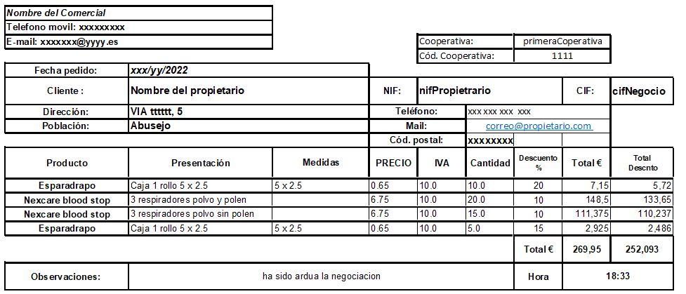

# Pillo-Comercial
Proyecto Programación Orientada a objetos (lenguaje Java) con finalidad Docente. Se pretende que los alumnos realicen un pequeño diseño y lo implementen, la solución no es única.

## Ejercicio

1. Se quiere realizar una aplicación para un comercial de productos de farmacia y parafarmacia, que le permita llevar las ventas.   
1. La aplicación será para un único comercial.
1. Los Propietarios solo pueden tener un `Negocio` (farmacia o Parafarmacia) pero se desea que cada `Propietario` haga muchos **Pedidos** al comercial.  
1. Un `Negocio` al menos tendrán un `nombre` una `dirección`, una serie de `Coperativas` con las que trabajan y un `Poc` (_persona de contacto_) que es la persona con la que se comunica el comercial.  
1. El `Pedido` que hace un `Propietario` de un `Negocio` se entregaran a los Propietarios en papel (mostrar en consola)  con los siguientes datos:
    * `fecha del pedido`  
    * `Precio total` con IVA (10%) y sin IVA del pedido
    * **Cantidad** de `Lineas de Pedido`  de productos solicitados 
    * `Precio` sin IVA de  cada `Linea de Pedido`
    * **Datos** del `Propietario` del `Negocio` 
    * `Cooperativa` con la que trabaja el `Negocio`.

1. Cada `Linea de Pedido` que tiene el `Pedido` tendrá el `Producto` que se vende, la cantidad que solicita el `Propietario` y el descuento que el comercial hace a ese `Propietario` en ese `Producto`.   
1. De cada `Producto`  se debe saber, al menos, su `nombre`, `referencia`, `precio`  y si está `activo` o no en el catálogo del comercial.

### Para comprobar que la aplicación está correcta imprima por consola un par de pedidos con al menos los datos que se han solicitado en los requisitos y varias líneas.

### Aclaraciones 

- Ejemplo de pedido: 

  
*No es importante el formato que utilicen para mostrarlo por consola ni el orden de los datos.*

#### Tips

- Busquen al máximo la simplicidad, el objetivo es prácticar _fundamentos de java, La Progrmación Orientada a Objetos, las Colecciones, Herencias, Interfaces etc_ que se han visto en el [temario](https://slides.com/kzurro) 
-  En el ejemplo de pedido aparecen más datos que en el diseño que muestra el [diagrama](https://github.com/kzurro/Pillo-Comercial/blob/main/diagramas/pillo_comercial.drawio). Queda a criterio del alumno crear más clases ee interfaces, o incluso disminuirlas, cambiar tipos de los atributos, añadir más atributos y métodos.
- Cualquier duda con el enunciado hagan un `issue`.
